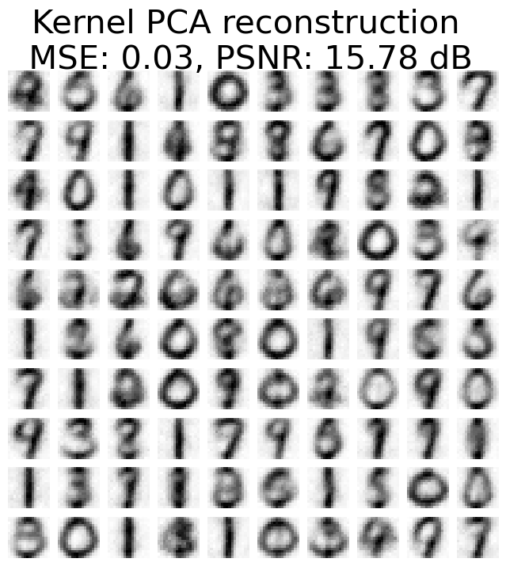

# Using machine learning for image denoising

This repository contains the *Python* code my blog post  [Image denoising techniques: A comparison of PCA, kernel PCA, autoencoder, and CNN](https://www.fabriziomusacchio.com/blog/2023-06-20-ai_image_denoising/). See  post for more details and results.

